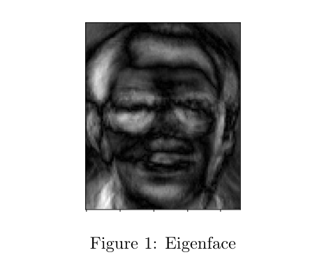
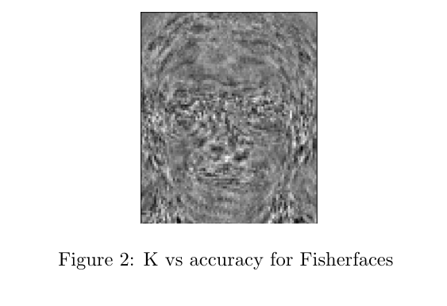
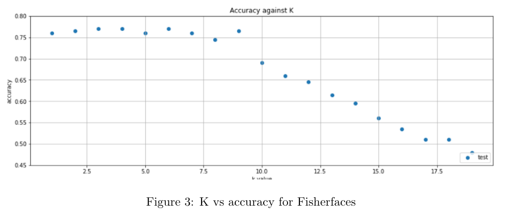
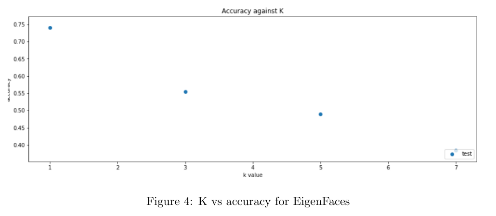

# FaceRecognition


Overview
========

The Project is structred into a helpers module containg helpers used to
load the images data from disk in numpy arrays, As for PCA, LDA and KNN
they all reside in a folder named classifiers with PCA and LDA exposing
the methods train and project and KNN exposing the methods train and
predict, back at the root of the project alongside the helpers module
there is the fisher faces module that uses both LDA and PCA to implement
the fisher faces algorithm descirbed in section 2.As for the actual
usage of these modules, we use three jupyter notebooks, one for testing
pca named PCA, another for testing lda named LDA and a last one for
testing the fisher faces with the name FisherFaces, all residing at the
root of the project.

PCA
===

EigenFaces
----------

The Principal Component Analysis (PCA) is one of the most successful
techniques that have been used in image recognition and compression. The
main objective of PCA is to reduce the large dimensionality of the data
space to the smaller dimensionality of feature space, which are needed
to describe the data economically. One of the simplest and most
effective PCA approaches used in face recognition systems is the so
called eigenface approach. This approach transforms faces into a small
set of essential characteristics, eigenfaces, which are the main
components of the initial set of learning images (training set).
Recognition is done by projecting a new image in the eigenface subspace,
after which the person is classified by comparing its position in
eigenface space with the position of known individuals.

Description of work
===================

In our assignment firstly, we separated the data set into two parts, the
training set and the test set. Then we used the PCA algorithm that
computes the mean vectors of each dimension, normalize the data,
computes the covariance matrix, eigen values and vectors. We sort the
eigen values descendingly and take the corresponding eigen vectors
(eigen faces) to it. We used four values for the alpha
[0.8,0.85,0.9,0.95], that will change the number of dimensions of the
eigen faces according to the explained variance. The higher the alpha
the bigger the dimensionality. Then we project the training data and
test data on our projection matrix which is the eigenface subspace,
Figure 1 shows one of the eigenfaces produced by the algorithm.

Finally we used the knn classifier to determine the class labels with k
= 1.

Results
-------

The accuracy of all values of alpha: testing accuracy (0.8) = 0.74
testing accuracy (0.85) = 0.70 testing accuracy (0.9) = 0.68 testing
accuracy (0.95) = 0.63

The lower the alpha the higher the accuracy as the training data is too
small and maybe if we increase the alpha it overshoots.



LDA
===

Description
-----------

Linear Discriminant Analysis (LDA) is a method used to reduce dimensions
in the aim of maximizing the between class separation and the within
class variance for better classification between different classes, the
method was first used to classify between 2 different classes now we are
using in to classify between more than two classes.

A problem with the straight forward implementation
--------------------------------------------------

In our Face Recognition example we are having a small set of examples
per class relative to the number of features representing each example,
this cause our within class scatter matrix **S** to be a low rank matrix
(the rank of S~w~ is at most N - c) and this results in **S** being
singular.

FisherFaces
-----------------

In order to solve this problem we are no heading to calculate the
**Fisherfaces** rather than the **Eigenfaces**. So now instead of using
**LDA** directly we will use **PCA** first to reduce the matrix from
$\mathit{\mathbf{N \times d\ to\ N\times\ (N-c)}}$ where N is the number
of examples, d is number of dimensions and c is the number of classes.So
now the PCA projection matrix is of size $200\times 160$ and data matrix
after PCA is $10304\times 160$ passing this data matrix to the LDA will
result and taking the most dominant C-1 fisherfaces will cause a
projection matrix of size $10304\times 39$ which s the required
projection matrix, the columns of this matrix are the fisher faces,
figure 1 shows the first fisher face.



K-nearest neighbours
====================

Implementation details
----------------------

The bulk of the implementation lies in the predict method (Listing 1)
which relies on calculating the euclidean distances between all test and
train pairs, sorting the distances ascendingly and then substituting the
first k distances with the class of the points they represent and
finally pick the class that has appeared the most in the first k points
as the predicted class.

``` {.python language="Python" caption="Knn" predict=""}
   def predict(self, X_test):
       dists = euclidean_distances(X_test, self.X_train)
       sorted_idx = np.argsort(dists, axis=1)
       labeled_idx = self.y_train[sorted_idx]
       first_k = labeled_idx[: ,:self.k]
       frequencies = np.apply_along_axis(np.bincount, 1,first_k, minlength=self.num_classes + 1)
       predictions = np.argmax(frequencies, axis=1)
       return predictions
```

Trying different K values for both Fisherfaces and EigenFaces
-------------------------------------------------------------

To test how the accuracy of classification varies with the value of K
when using both Fisherfaces and EigenFaces.\
As for Fisherfaces we plotted the accuracy for values ranging from 1 to
20 (Figure 2), since the graph didn’t seem to decerease in an
exponentially decaying fashion as in the case with PCA, so we increased
the range to make sure we get the best value of K, however after
plotting the graph it turned out the best accuracy of 77% was obtained
with k equaling 3.\
For EigenFaces we plotted four graphs similar to the one plotted for
Fisherfaces, one for each value of alpha, Figure 3 shows the alpha
equaling 0.8.Here we only plotted for values of k from 1 to 7 since the
graph seemed to decrease exponentially.





Bonus
=====

How many dominant eigenvectors will you use for the LDA solution? The
number of dominant eigenvectors will be equal to number of classes - 1,
we are using CIFAR-10, of 10 classes, so 9 dominant eigenvectors will be
used for the LDA
